<h2>
JPA Hibernate, Spring Data
</h2>
<h4> 1. Créer un projet Spring Initializer avec les dépendances JPA, H2, Spring Web et Lombok</h4>
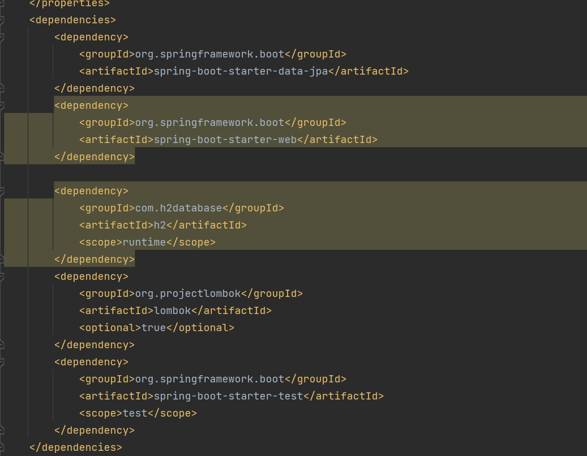

<h4> 2. Créer l'entité JPA Patient ayant les attributs :</h4>
<h6>- id de type Long </h6>
<h6>- nom de type String</h6>
<h6>- dateNaissanec de type Date</h6>
<h6>- malade de type boolean</h6>
<h6>- score de type int</h6>

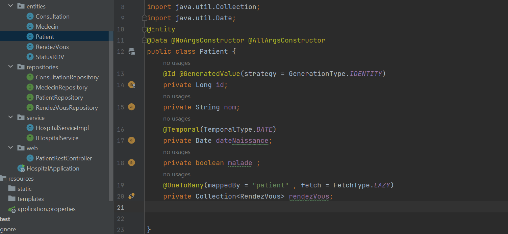
<h4></h4>
<h4>3. Configurer l'unité de persistance dans le ficher application.properties </h4>
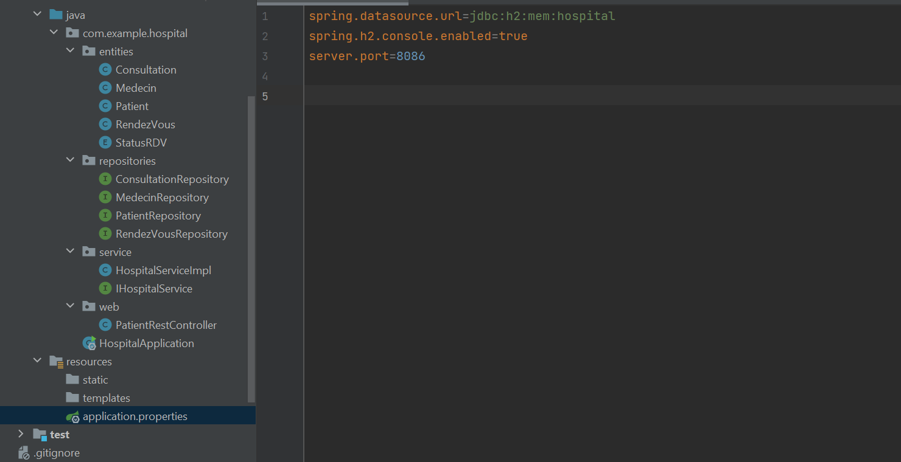
<h4> 4. Créer l'interface JPA Repository basée sur Spring data</h4>
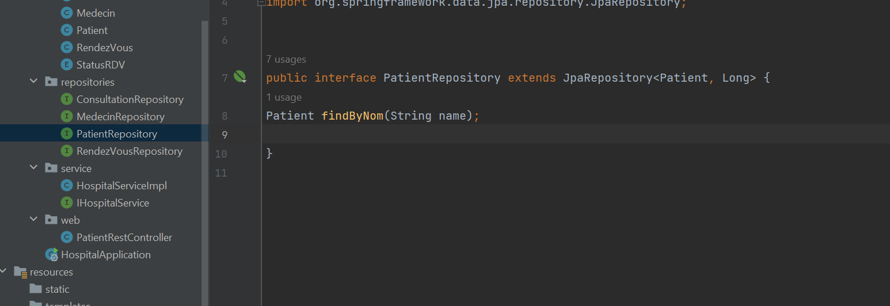

<h4> 5. Tester quelques opérations de gestion de patients :</h4>
<h6>- Ajouter des patients </h6>
<h6>- - Consulter tous les patients</h6>
<h6>- Consulter un patient</h6>
<h6>- Chercher des patients</h6>
<h6> Mettre à jour un patient</h6>
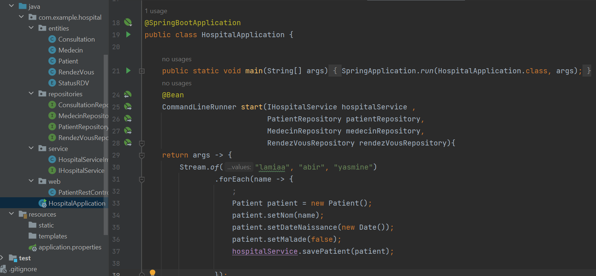

<h4>6. Migrer de H2 Database vers MySQL</h4>
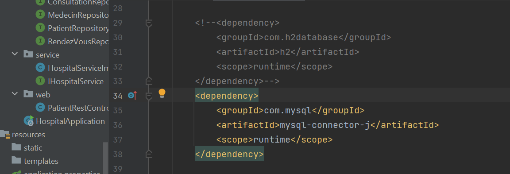

<h4>7. Les exemples du Patient, Médecin, rendez-vous, consultation, users et roles </h4>
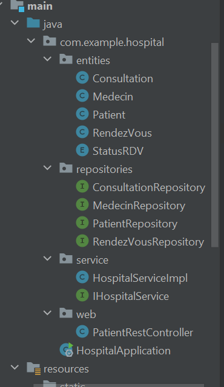
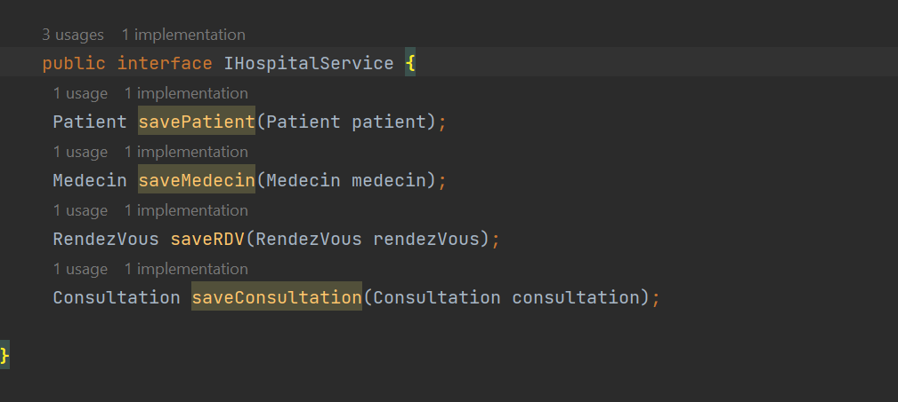
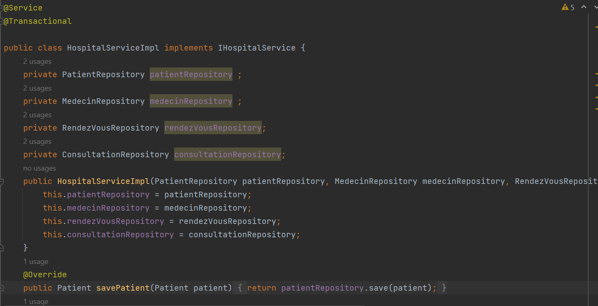
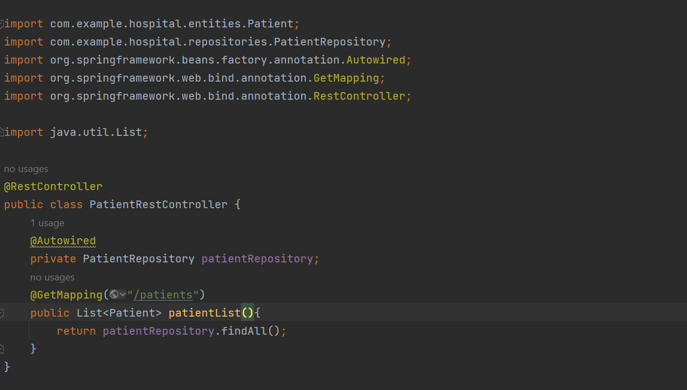
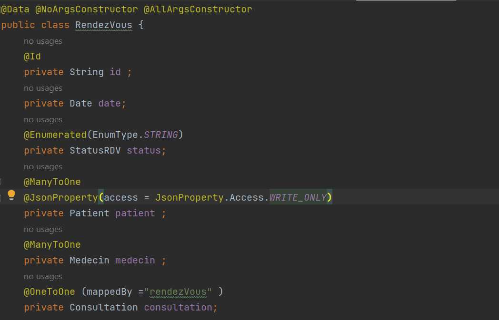